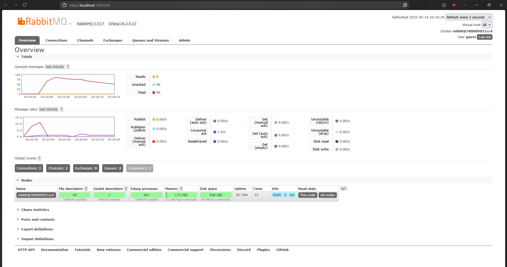

### a. What is ampq?

AMQP stands for Advanced Message Queuing Protocol.
It is an open standard protocol used for message-oriented middleware. It enables different systems to communicate with each other via messages, in a reliable, secure, and asynchronous way.It is commonly used with message brokers like RabbitMQ.

### b. What does it mean? guest:guest@localhost:5672, what is the first guest, and what is the second guest, and what is localhost:5672 is for?

The first `guest` is the username. The second `guest` is the password. `localhost` is the address of the server running RabbitMQ (in this case, your local machine). `5672` is the default AMQP port RabbitMQ listens on.

### Slow Subscriber Simulation

The chart displays a spike in published messages (yellow) without a corresponding spike in delivered or acknowledged messages (purple). This indicates that the subscriber is processing messages more slowly than they are being published. Consequently, there are currently 20 (46 because of my previous sessions) messages in the "Unacked" state — they’ve been delivered to the consumer but haven’t yet been acknowledged.
